End-Point:
http://app.local/ — Nginx Static Page

http://app.local/whoami/ — Whoami Service

http://app.local/api/ - backend (PodInfo)

# Assigment-1_kubernetes_practice:
step-1: first create namespace.yaml file 
    kubectl apply -f namespace.yaml
    kubectl config set-context --current --namespace=assign1  |to set defualt namespace to avoid -n again|again
step-2 : run redis deployment
    kubectl apply -f redis-deployment.yaml --dry-run=client | to dry run yaml  
    kubectl apply -f redis-deployment.yaml
 #to show all kubernets object in perticular namespace   
    kubectl get all
  

before update : 
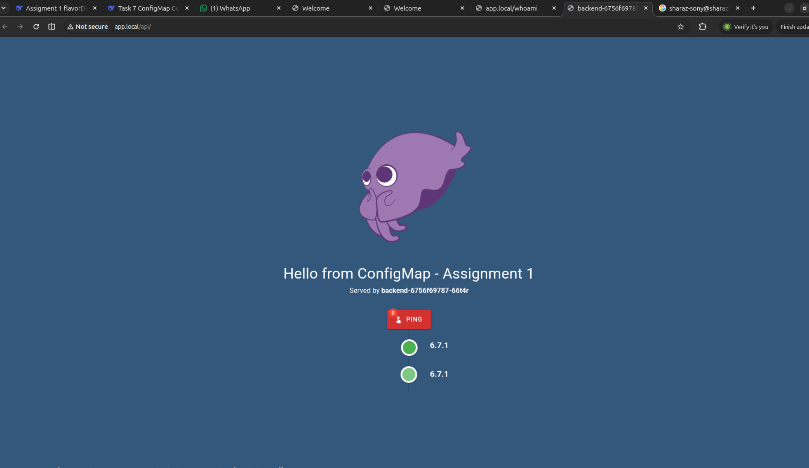

task-7: edit massage of podinfo_ui_massage:  update it massage
   
  kubectl rollout restart deployment backend

after 
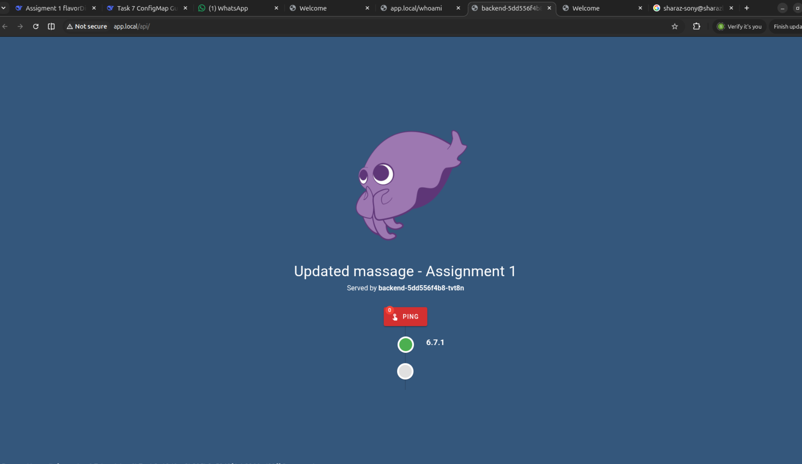

now set immutable flag True : 

sharaz-sony@sharazlab:~/kubernetes_assigment_1$ kubectl apply -f ConfigMap.yaml
configmap/podinfo-config configured
sharaz-sony@sharazlab:~/kubernetes_assigment_1$ kubectl rollout restart deployment backend
deployment.apps/backend restarted
sharaz-sony@sharazlab:~/kubernetes_assigment_1$ kubectl rollout status deployment backend
Waiting for deployment "backend" rollout to finish: 1 old replicas are pending termination...
Waiting for deployment "backend" rollout to finish: 1 old replicas are pending termination...
deployment "backend" successfully rolled out
sharaz-sony@sharazlab:~/kubernetes_assigment_1$ 

in backend_deployment 
set these :
  revisionHistoryLimit: 3        # ← sirf 3 purane versions rakho
  strategy:
    type: RollingUpdate
    rollingUpdate:
      maxSurge: 1                # ← 1 extra pod allowed
      maxUnavailable: 0          # ← 0 pods unavailable (zero downtime)

sharaz-sony@sharazlab:~/kubernetes_assigment_1$ kubectl apply -f podinfo.yaml
error: the path "podinfo.yaml" does not exist
sharaz-sony@sharazlab:~/kubernetes_assigment_1$ kubectl apply -f backend_deploy.yaml
deployment.apps/backend configured
sharaz-sony@sharazlab:~/kubernetes_assigment_1$ kubectl rollout status deployment podinfo
Error from server (NotFound): deployments.apps "podinfo" not found
sharaz-sony@sharazlab:~/kubernetes_assigment_1$ kubectl rollout status deployment backend
deployment "backend" successfully rolled out
sharaz-sony@sharazlab:~/kubernetes_assigment_1$ 

sharaz-sony@sharazlab:~/kubernetes_assigment_1$ kubectl rollout history deployment backend
deployment.apps/backend 
REVISION  CHANGE-CAUSE
1         <none>
2         <none>
3         <none>

sharaz-sony@sharazlab:~/kubernetes_assigment_1$ 

kubectl set image command YAML file ko touch nahi karti. Ye seedha cluster mein deployment ko update kar deti hai. YAML file aap ki local machine par wesi hi rehti hai (purani image ke sath).

Kya hota hai kubectl set image chalane par?
bash
kubectl set image deployment/podinfo podinfo=ghcr.io/stefanprodan/podinfo:99.99.99

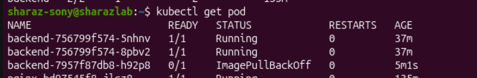

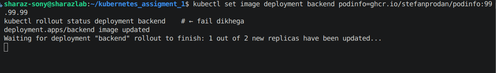

three created because maxSurge = 3 hai iss liye

ilkul Sahi Samjhe! Ye Git Commits Jaisa Hi Hai 🎯
Aap ka comparison 100% theek hai. Chalo detail mein samjhaata hoon:

Git vs Kubernetes Rollout History
Git	Kubernetes
git log	kubectl rollout history deployment/backend
Commit a1b2c3	Revision 1
Commit d4e5f6	Revision 2
git checkout a1b2c3	kubectl rollout undo --to-revision=1
Commit message	CHANGE-CAUSE (annotation se)
Purane commits	Purani revisions (limit ke baad delete)
Concept bilkul same hai — dono ek history rakhte hain jahan se aap wapas ja sakte ho.

Ek Revision Ki Poori Detail Dekho
bash
kubectl rollout history deployment/backend --revision=4

sharaz-sony@sharazlab:~$ kubectl rollout history deployment/backend --revision=4 > rev4.txt
kubectl rollout history deployment/backend --revision=5 > rev5.txt
sharaz-sony@sharazlab:~$ diff rev4.txt rev5.txt
1c1
< deployment.apps/backend with revision #4
---
> deployment.apps/backend with revision #5
4c4
< 	pod-template-hash=7957f87db8
---
> 	pod-template-hash=756799f574
9c9
<     Image:	ghcr.io/stefanprodan/podinfo:99.99.99
---
>     Image:	ghcr.io/stefanprodan/podinfo:6.7.1
sharaz-sony@sharazlab:~$ 
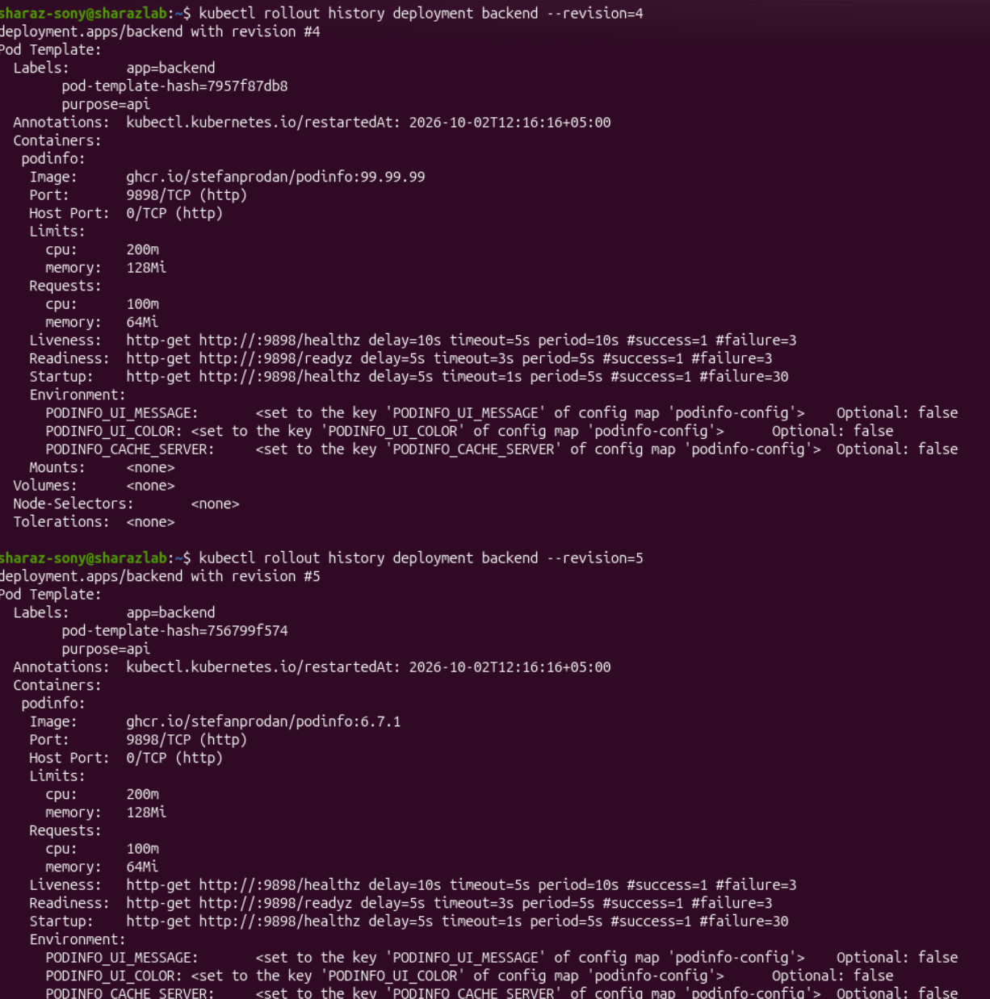

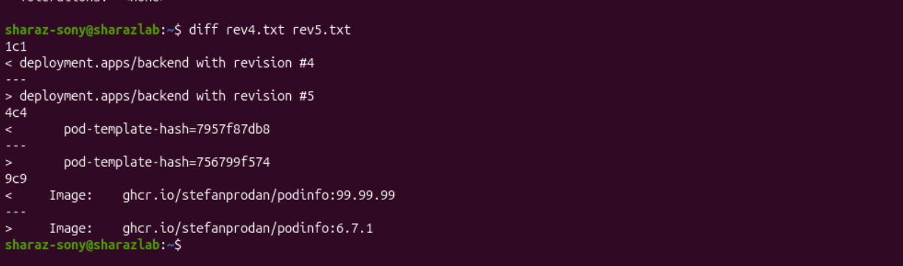

Bilkul Sahi Pakra! Ye Kubernetes Ka Ajeeb Sa Behavior Hai 🤯
Aap ne --to-revision=4 chalaya, lekin history mein 4 ghayab ho gayi aur naya 6 ban gaya. Ye mazak nahi — ye Kubernetes ka design hai. Samjho:

Asal Formula (Ye Yaad Rakho)
rollout undo purani revision ko DELETE karta hai aur naya revision BANA deta hai.

Woh purana number wapas nahi aata — naya number milta hai.

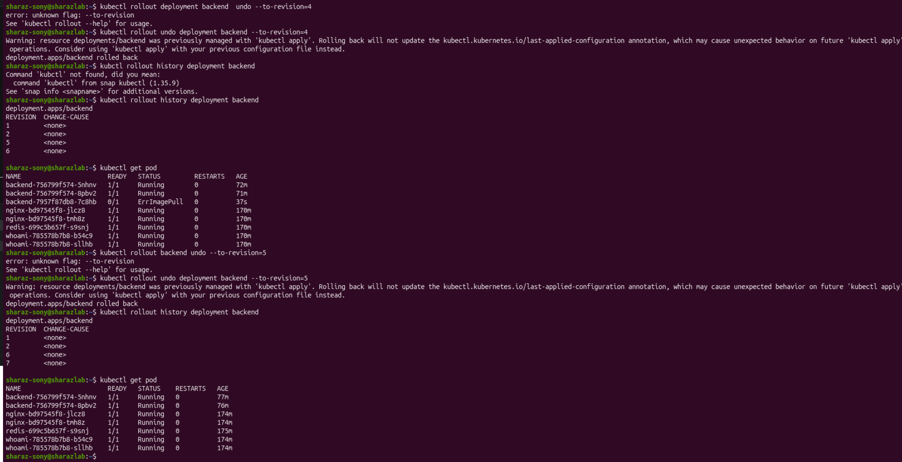

#backend pod ke ander jana ki command 
kubectl exec -it deploy/backend -- sh

1. Aap: kubectl exec ... curl -X POST http://localhost:9898/cache/mykey -d "myvalue"
                            ↓
2. Podinfo app (pod ke andar, port 9898) request receive karti hai
                            ↓
3. Podinfo app apne env var PODINFO_CACHE_SERVER ko dekhti hai
                            ↓
4. Wahan likha hai: tcp://redis:6379
                            ↓
5. Podinfo app Redis pod se connect karti hai (DNS name "redis" se)
                            ↓
6. Redis mein mykey = myvalue SAVE ho jata hai
                            ↓
7. Response wapas aap tak: OK

http://localhost:9898/cache/mykey
       ↑         ↑       ↑     ↑
    protocol   port   endpoint  key

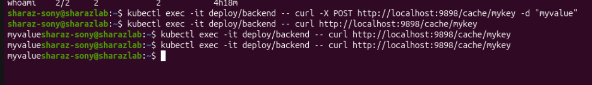

kubectl delete pod -l app=redis

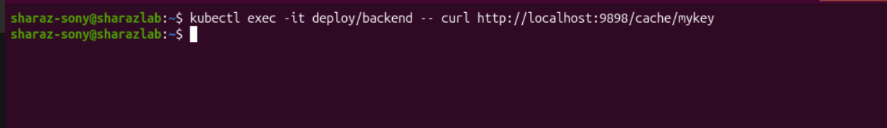

  STEP 2 — Aapne command chalayi
  ────────────────────────────────
  curl -X POST http://localhost:9898/readyz/disable
                                          ↑
                           Podinfo app ne apna /readyz
                           endpoint "fail" mode mein dal diya
                           (internally flag set ho gaya)
  
  
  STEP 3 — readinessProbe check kiya (har 5 sec baad)
  ─────────────────────────────────────────────────────
  Kubernetes: "6ph9h, /readyz kaisa hai?"
  6ph9h:      HTTP 500 ← FAIL! (disable kiya tha na)
  
  1st fail → warning
  2nd fail → warning  
  3rd fail → failureThreshold: 3 reach hua!
             → Pod READY=0 ho gaya
  
  
  STEP 4 — Service ne respond kiya
  ──────────────────────────────────
  backend-6ph9h   0/1  Running  ❌  ← READY nahi
  backend-b88sd   1/1  Running  ✅  ← READY hai
  
  Service ne socha: "6ph9h ready nahi → usse traffic mat bhejo"
  Traffic 100% → b88sd par chali gayi
  
  
  STEP 5 — livenessProbe abhi bhi pass ho raha tha
  ──────────────────────────────────────────────────
  /healthz = alag endpoint = HAMESHA OK return karta hai
  isliye pod KILL nahi hua, sirf traffic stop hui
  RESTARTS: 1 (pehle se tha, iss wajah se naya nahi hua)
  
  ──────────────────────────────────────────────────────────────────────────────────────────────────────────────────────────
  
  YAML mein exact settings jo kaam aayi
  
  readinessProbe:
    httpGet:
      path: /readyz        # ← yeh fail hua jab disable kiya
      port: 9898
    initialDelaySeconds: 5  # start ke 5 sec baad check shuru
    periodSeconds: 5        # har 5 sec baad check
    timeoutSeconds: 3       # 3 sec mein jawab nahi → fail
    failureThreshold: 3     # 3 baar fail → READY=0
  
  livenessProbe:
    httpGet:
      path: /healthz       # ← yeh alag path hai, pass hota raha
      port: 9898
    failureThreshold: 3    # yeh fail nahi hua → pod kill nahi hua
  
  ─────────────────────────────────────────────────────────────────────────────────────────────────────────────
  

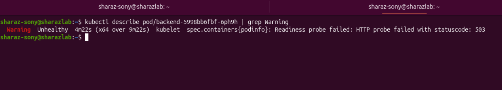

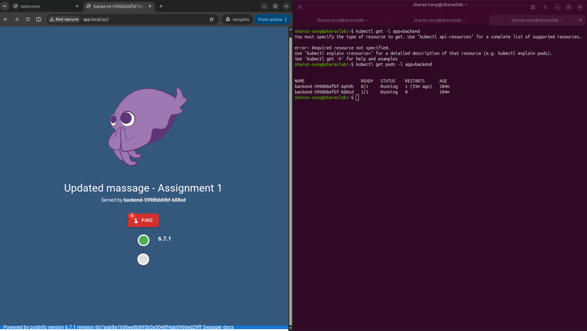

sharaz-sony@sharazlab:~$ kubectl get endpoints backend    # wo pod ghayab
Warning: v1 Endpoints is deprecated in v1.33+; use discovery.k8s.io/v1 EndpointSlice
NAME      ENDPOINTS                           AGE
backend   10.244.0.31:9898,10.244.0.32:9898   6h3m

when i run this command :

kubectl exec -it $POD -- curl http://localhost:9898/panic

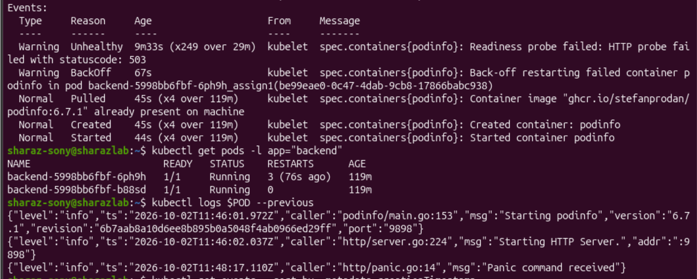

i see in previous log this command panic command run pod crash and then count increase reset.

{"level":"info","ts":"2026-10-02T11:48:17.110Z","caller":"http/panic.go:14","msg":"Panic command received"}

kubectl logs $POD --previous         # purane container ke logs (jo crash hua)
kubectl describe pod $POD            # poori detail
kubeckubectl logs $POD --previous         # purane container ke logs (jo crash hua)
kubectl describe pod $POD            # poori detail
kubectl get events --sort-by=.metadata.creationTimestamp   # kya kya huatl get events --sort-by=.metadata.creationTimestamp   # kya kya hua

Kyun seekhte ho: Kabhi pod mein curl, wget, nslookup jaise tools nahi hote. Aap pod mein install nahi kar sakte (read-only). To kubectl debug se bahar se ek container le kar aate ho aur us se test karte ho.

Pehle Samjho: Ye Command Karti Kya Hai?
bash
kubectl debug -it $POD --image=busybox:1.36 --target=podinfo

Asaan lafzon mein: Aap ke chalte hue pod ke andar ek naya temporary container (busybox) daal deti hai. Is container se aap asli container (podinfo) se baat kar sakte ho.

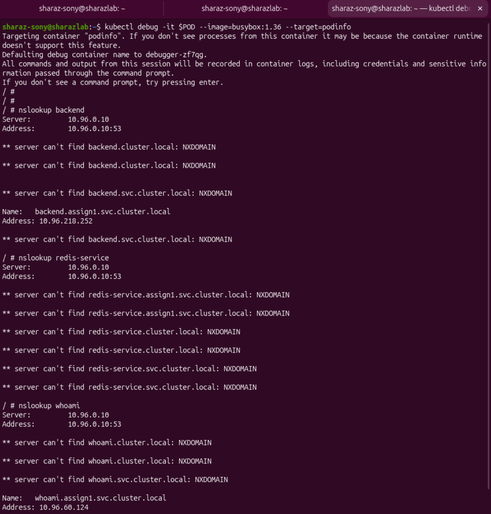

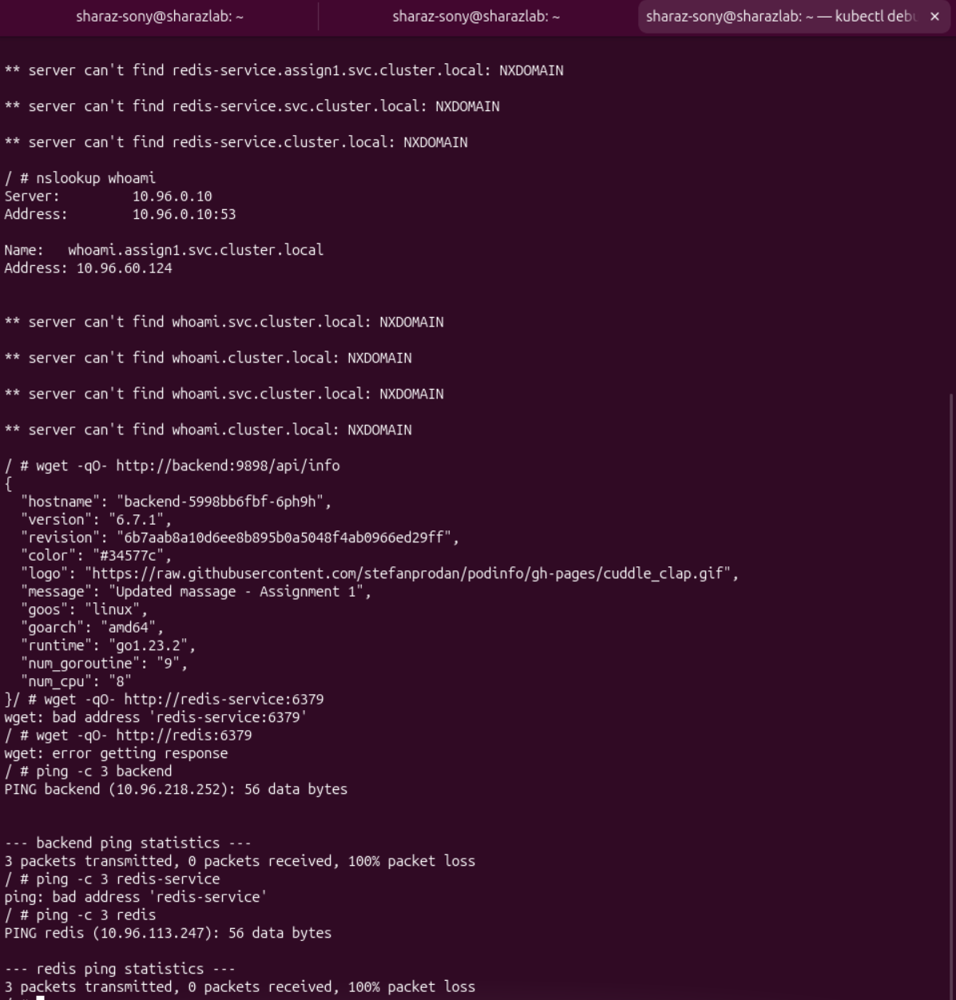

1. NXDOMAIN Kya Hai?
NXDOMAIN = Non-Existent Domain = "Ye naam exist nahi karta"

<service-name>.<namespace>.svc.cluster.local

Aap ke case mein:

Hissa	Value	Matlab
backend	Service ka naam	Aap ki service ka naam
assign1	Namespace	Aap ka namespace
svc	Service	Ye service hai (pod nahi)
cluster.local	Cluster domain	Kubernetes ka default domain
